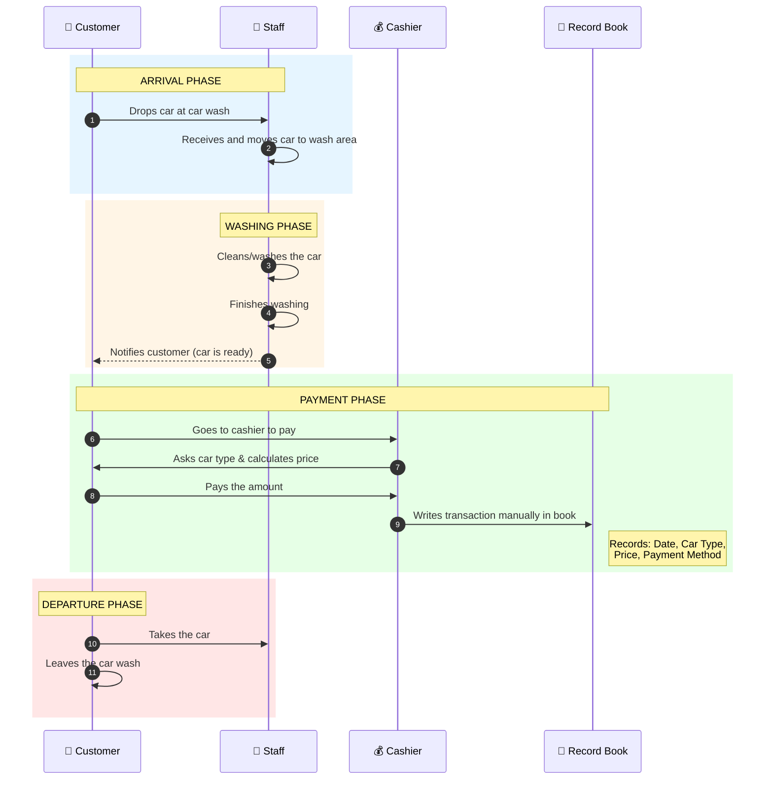

# Carwash Application - Comprehensive Report

## 1. Application Overview

**Application Name:** Carwash Management System  
**Technology Stack:** Laravel 11 + React (Inertia.js) + TypeScript + TailwindCSS  
**Database:** SQLite (configurable)  
**Purpose:** A complete Point of Sale (POS) and management system for car wash businesses

---

## 1.1 Manual Transaction Flow Diagram (Current System)

This diagram illustrates the traditional/manual car wash transaction process before digitalization:



### Manual Process Steps:

| Step | Actor | Action | Problem |
|------|-------|--------|---------|
| 1 | Customer | Drops car at car wash | No digital record of arrival time |
| 2 | Staff | Moves car to wash area | No tracking of which staff handles which car |
| 3 | Staff | Cleans the car | No time tracking, no staff fee calculation |
| 4 | Customer | Pays at cashier | Price calculation is manual, prone to errors |
| 5 | Cashier | Writes in record book | Slow, hard to search, no reports |
| 6 | Customer | Takes car and leaves | No customer history tracking |

---

## 2. Background & Context

### Key Background Points:
1. **Industry Context**: Car wash businesses need efficient transaction management, staff tracking, and revenue monitoring
2. **Target Users**: Car wash business owners and their employees (cashiers/operators)
3. **Business Need**: Replace manual/paper-based record keeping with a digital solution
4. **Operational Requirements**: 
   - Real-time transaction tracking
   - Multiple payment method support
   - Staff performance monitoring
   - Revenue reporting and analytics
5. **Accessibility**: Web-based application accessible from any device with a browser

---

## 3. Problem Analysis & Solutions

### Problems Identified:

| Problem | Impact | Solution in Application |
|---------|--------|-------------------------|
| **Manual Transaction Recording** | Human error, time-consuming, difficult to track | Digital transaction system with auto-generated invoice numbers (INV-YYYYMMDD-XXXX format) |
| **No Real-time Revenue Visibility** | Owners can't monitor daily income easily | Dashboard with live stats (today's transactions, revenue, pending payments, cars in progress) |
| **Staff Performance Tracking Difficulty** | Hard to measure individual staff productivity | Staff fee tracking per transaction, performance reports with date range filtering |
| **Customer Relationship Management** | No customer history, can't identify loyal customers | Customer database with transaction history and total spending tracking |
| **Complex Pricing Structure** | Different prices for different car sizes/wash types | CarwashType model with min/max price ranges and size categories |
| **Multiple Payment Methods** | Cash, transfer, e-wallet tracking is messy | Dedicated PaymentMethod management with active/inactive status |
| **Report Generation** | Time-consuming manual report creation | Automated PDF export for 5 report types |
| **Role-based Access Control** | Sensitive data exposed to all employees | Owner vs Regular user roles with restricted access |

---

## 4. Key Features & Functionality

### 4.1 Transaction Management
- **Create Transaction**: Customer selection, car wash type, staff assignment, payment method
- **Invoice Generation**: Auto-generated format `INV-YYYYMMDD-XXXX`
- **Payment Status**: `paid` / `unpaid` tracking
- **Wash Status**: `waiting` / `washing` / `done` workflow
- **Staff Fee**: Track fees per staff member per transaction
- **License Plate Recording**: Vehicle identification

### 4.2 Customer Management
- **Customer Profile**: Name, phone, address, notes
- **Transaction History**: All past transactions linked to customer
- **Spending Analytics**: Total spending calculation per customer
- **CRUD Operations**: Create, Read, Update, Delete customers

### 4.3 Staff Management (Owner Only)
- **Staff Profile**: Name, phone, active status
- **Earnings Tracking**: Total fees earned per staff
- **Transaction Count**: Number of transactions handled
- **Active/Inactive Status**: Manage staff availability

### 4.4 Car Wash Type Management (Owner Only)
- **Service Types**: Define different wash services
- **Size Categories**: Categorize by vehicle size
- **Price Range**: Min/max pricing per type
- **Description**: Service details
- **Active Status**: Enable/disable services

### 4.5 Payment Method Management (Owner Only)
- **Method Types**: Cash, Transfer, E-Wallet, etc.
- **Active Status**: Enable/disable payment options

### 4.6 Dashboard
- **Today's Transactions**: Real-time transaction count
- **Today's Revenue**: Total income for the day
- **Pending Payments**: Unpaid transactions count
- **Cars in Progress**: Currently being washed
- **Total Customers**: Overall customer count
- **Active Staff**: Available staff count
- **Recent Transactions**: Last 5 transactions list

### 4.7 Reporting System (PDF Export)
1. **Daily Report**: All transactions for a specific date
2. **Monthly Report**: Daily breakdown for selected month
3. **Car Type Report**: Revenue by car wash type (date range)
4. **Staff Performance Report**: Staff productivity and earnings (date range)
5. **Income Trend Report**: Daily revenue trend with averages

### 4.8 User Management (Owner Only)
- **User Accounts**: Create cashier/operator accounts
- **Role Assignment**: Owner vs Regular user
- **Access Control**: Restrict sensitive features

---

## 5. Data Model Structure

### Core Entities:
```
┌─────────────┐     ┌────────────────┐     ┌─────────────┐
│   Customer  │────<│  Transaction   │>────│  CarwashType│
└─────────────┘     └────────────────┘     └─────────────┘
       │                    │                      
       │                    │ M:N via              
       │                    │ transaction_staffs   
       │                    ▼                      
       │            ┌─────────────┐                
       │            │    Staff    │                
       │            └─────────────┘                
       │                    
       │            ┌─────────────────┐            
       └───────────>│  PaymentMethod  │            
                    └─────────────────┘            
```

### User Roles:
- **Owner**: Full access (users, staff, carwash types, payment methods, all reports)
- **Regular User (Cashier)**: Transactions, customers, reports only

---

## 6. Technical Architecture

### Backend (Laravel 11):
- **Controllers**: Dashboard, Transaction, Customer, Staff, CarwashType, PaymentMethod, Report, User
- **Models**: User, Customer, Staff, Transaction, TransactionStaff (pivot), CarwashType, PaymentMethod
- **PDF Generation**: DomPDF for report exports
- **Authentication**: Laravel Fortify with two-factor authentication support

### Frontend (React + TypeScript):
- **Framework**: Inertia.js for SPA-like experience
- **Styling**: TailwindCSS v4
- **UI Components**: Radix UI, Headless UI, Lucide React icons
- **Pages**: Dashboard, Auth, Transactions, Customers, Staffs, CarwashTypes, PaymentMethods, Reports, Users, Settings

---

## 7. Key Points for Study/Documentation

### Research Dimensions:

1. **Business Process Digitalization**
   - How the application transforms manual car wash operations into digital workflows
   - Efficiency gains from automated invoice generation and real-time tracking

2. **Point of Sale (POS) System Design**
   - Transaction lifecycle management (create → payment → wash → complete)
   - Multi-entity relationship handling (customers, staff, services)

3. **Role-Based Access Control (RBAC)**
   - Owner vs employee permissions
   - Protecting sensitive business data

4. **Financial Reporting**
   - Revenue analytics and trend analysis
   - Staff productivity measurement
   - Multi-dimensional reporting (daily, monthly, by service, by staff)

5. **Customer Relationship Management (CRM)**
   - Customer transaction history
   - Spending pattern tracking
   - Loyalty identification potential

6. **Staff Performance Management**
   - Fee-based compensation tracking
   - Productivity metrics
   - Workload distribution

7. **Modern Web Application Architecture**
   - Laravel + React (Inertia.js) integration
   - Single Page Application (SPA) benefits
   - PDF generation for printable reports

---

## 8. Summary for ChatGPT Context

```
This is a Car Wash Management System built with Laravel 11 and React (Inertia.js).

CORE FEATURES:
- Transaction/POS system with invoice generation
- Customer database with spending history
- Staff management with fee tracking
- Multiple car wash service types with price ranges
- Multiple payment methods
- Dashboard with real-time business metrics
- 5 types of PDF reports (daily, monthly, car type, staff, income trend)

USER ROLES:
- Owner: Full administrative access
- Cashier: Transaction and customer management only

PROBLEM SOLVED:
Replaces manual/paper-based car wash operation with digital solution providing real-time tracking, automated reporting, and business analytics.

TECH STACK:
Laravel 11 + React + TypeScript + Inertia.js + TailwindCSS + SQLite
```

---

## 9. Suggested Report Structure (Word Document)

### Chapter 1: Introduction
- Background of the study
- Problem statement
- Objectives
- Scope and limitations

### Chapter 2: Theoretical Foundation
- Point of Sale systems
- Web application development
- Laravel framework
- React.js

### Chapter 3: System Analysis
- Current system analysis
- Proposed system requirements
- Use case diagrams
- Data flow diagrams

### Chapter 4: System Design
- Database design (ERD)
- User interface design
- System architecture

### Chapter 5: Implementation
- Development environment
- Key features implementation
- Testing results

### Chapter 6: Conclusion
- Summary
- Future development recommendations
